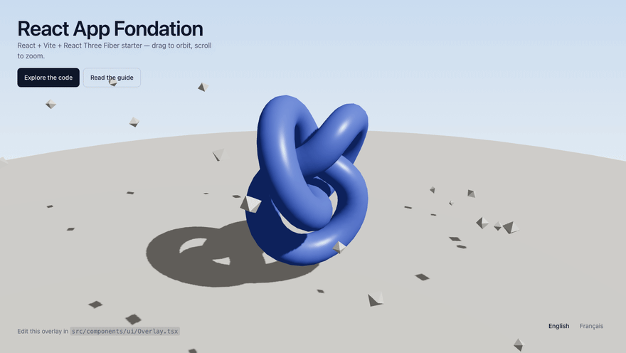
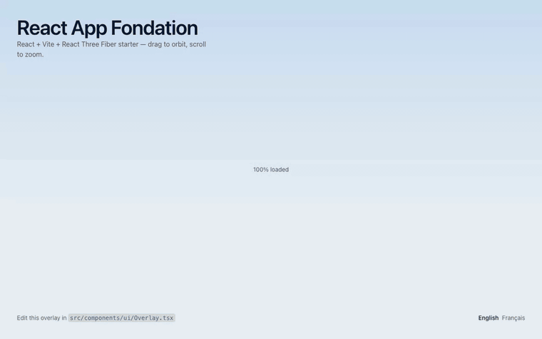

<div align="center">

<h1>React App Fondation</h1>

**Production starter for static React sites with a WebGL scene.**<br>
React 19 · Vite 8 · TanStack Start · React Three Fiber — pre-rendered, translated, measured.

**[Live demo →](https://antoinepoisson.github.io/React-Production-Starter/)**

<!-- The badges point at this repository. After `node initialize.js`, swap the owner/repo in the
     CI badge and re-measure the rest: they are numbers, not decorations. -->

[](https://github.com/AntoinePoisson/react-production-starter/actions/workflows/ci.yml)
[](#measured-not-claimed)

[](#measured-not-claimed)
[](#measured-not-claimed)
[](#measured-not-claimed)
[](#measured-not-claimed)

[](https://react.dev)
[](https://vite.dev)
[](https://www.typescriptlang.org)
[](https://threejs.org)



</div>

Tests, E2E, git hooks, conventional commits, releases and bundle budgets are already wired up. No
host is prescribed: the pipeline builds and gates your site, then hands you a `dist/client/` and an
empty deploy step.

## Measured, not claimed

Lighthouse 13, median of three runs, against the production build served by `pnpm website`:

|                    | Performance | Accessibility | Best practices | SEO     |
| ------------------ | ----------- | ------------- | -------------- | ------- |
| Desktop            | **100**     | **100**       | **100**        | **100** |
| Mobile (throttled) | **99**      | **100**       | **100**        | **100** |

Desktop: FCP 0.3 s · LCP 0.4 s · TBT 0 ms · CLS 0.
Throttled mobile: FCP 1.2 s · LCP 2.0 s · TBT 50 ms · CLS 0.

- **99 kB brotli before first paint** — HTML, inlined CSS and JS together. three.js, drei and the
  scene are another ~210 kB that download _after_ the copy is on screen, never in front of it.
- **100 % coverage** on statements, branches, functions and lines — enforced, not reported:
  `pnpm test` fails below it.
- **395 unit tests** and **34 E2E scenarios** across five browser projects, covering Core Web
  Vitals, FPS and memory, WebGL init and context loss, responsive behaviour and locale switching.
- **Budgets in CI**: 600 kB JS, 6 kB CSS, 8 kB HTML, measured brotlied on `dist/client/`.

Reproduce all of it:

```bash
pnpm test                                    # coverage, with the 100 % gate
pnpm build && pnpm website                   # terminal 1 — the real build on :3200
pnpm dlx lighthouse@13.4.1 http://localhost:3200 --view --preset=desktop
```

Measure the dev server instead and you will score in the twenties: it serves unbundled modules,
unminified, with HMR attached. That number says nothing about the site you ship.

## Getting started

```bash
node initialize.js     # rename the project, reset the version history
pnpm install           # installs the git hooks
pnpm dev               # localhost:3000
```

`initialize.js` asks for a name, description, author and URL, rewrites the places the template
names itself, and offers to drop the 3D demo. `--dry-run` shows what it would touch. Delete it
once it has run.

## Stack

- **React 19 + Vite 8 + TanStack Start** — every route pre-rendered to static HTML
- **three.js / React Three Fiber / drei** — demo scene in `src/scene/demo/`, meant to be deleted
- **Tailwind CSS v4** — CSS-first, palette in `src/app/globals.css`
- **Lingui** — English and French, one document per locale
- **Vitest** (100 % coverage) **· Playwright** (5 browsers) **· Storybook** + axe
- **Lefthook · commitlint · Release-Please · knip · size-limit**

## Commands

|                                             |                                                                          |
| ------------------------------------------- | ------------------------------------------------------------------------ |
| `pnpm dev`                                  | Dev server                                                               |
| `pnpm build`                                | Pre-render, then SEO files, service worker, inlined CSS and CSP          |
| `pnpm website`                              | Serve the real build on :3200 — the only fair way to measure performance |
| `pnpm test`                                 | Vitest with coverage                                                     |
| `pnpm e2e`                                  | Playwright                                                               |
| `pnpm storybook`                            | Component workshop on :3140                                              |
| `pnpm lint` · `typecheck` · `knip` · `size` | Quality gates, same as CI                                                |
| `pnpm i18n`                                 | Re-extract and compile the catalogues                                    |
| `pnpm assets:brand`                         | Regenerate the icons and OG image from one vector source                 |

`pnpm run audit` needs the `run`: `pnpm audit` is a built-in that shadows the script.

Do not ship `vite build` on its own — the post-build step writes `robots.txt`, `sitemap.xml`,
`llms.txt` and the service worker, inlines the stylesheet and moves the CSP to the front of
`<head>`.

## Structure

```
src/
├── routes/        __root (document shell), index (/), $locale (/en, /fr), 404
├── app/           Metadata, boot wiring, globals.css, pages
├── components/    ClientOnly, three/ (canvas, loaders), ui/ (the overlay)
├── scene/         What is on stage — demo/ is placeholder
├── i18n/          Locales, catalogues, in-place locale switching
└── utils/         logger · screen · store · theme · vitals · config
```

## Things worth knowing

**The canvas is mounted by the shell, not by the page.** `/`, `/en` and `/fr` are separate
routes, so a scene mounted inside one is destroyed on every language switch.

<div align="center">
  
  <p><em>Switching locale swaps the catalogue in place — same WebGL context, same camera, no reload.</em></p>
</div>

**The overlay is pre-rendered, the canvas is not.** The copy is in the HTML and paints before
three.js downloads. Only the canvas is wrapped in `<ClientOnly>`, and nothing the shell imports
statically may reach into three.js or drei — a single `useProgress` in the loading fallback once
put the whole 3D bundle back on the critical path, and cost six Lighthouse points.

**Colour lives in `globals.css`** as `@theme static` tokens. The DOM reads it through Tailwind,
three.js through `sceneColor()`. A test compares those tokens against `manifest.json`.

**Logging goes through `src/utils/logger`**, which fans out to registered transports — adding a
real service is one `addTransport` call. Inside a frame loop, use `log.every(ms, key)`.

**The CSP meta tag is a floor.** `script-src` needs `'unsafe-inline'` because the router injects
inline scripts during hydration and a static site has no nonce; the inlined stylesheet, whose
bytes are known at build time, is pinned by hash instead. Set a real policy as a response header
at your edge, where `frame-ancestors` also works.

A few decisions were made from measurements: no `<Sky />` (a full-screen shader, ~8 ms/frame), no
preload on the hero asset (cost ~700 ms of LCP), no `<Preload all />`, and the Draco decoder kept
out of the service worker precache.

## Deployment

`.github/workflows/ci.yml` has three deploy jobs — `develop`, `main`, `prod`. `develop` and `prod`
carry the gating logic and an empty step to fill in:

```yaml
- name: Deploy
  run: |
    echo "::notice::No deployment provider configured — the site is in ./dist/client"
    # ▼ Your deployment command goes here. ▼
```

`main` is wired to GitHub Pages for real — that's what serves the
[live demo](https://antoinepoisson.github.io/React-Production-Starter/) above. It needs one repo
setting no workflow file can set: **Settings → Pages → Build and deployment → Source: "GitHub
Actions"**. Left on "Deploy from a branch", Pages renders `README.md` instead, since
`dist/client/` is never committed.

Publish `dist/client/`. Keep deploy before release, so no tag points at undeployed code.
`develop` and `main` deploy even if tests fail; `prod` does not.

Set `VITE_SITE_URL` as a repository variable, or every page ships a localhost canonical.

## Licence

MIT
